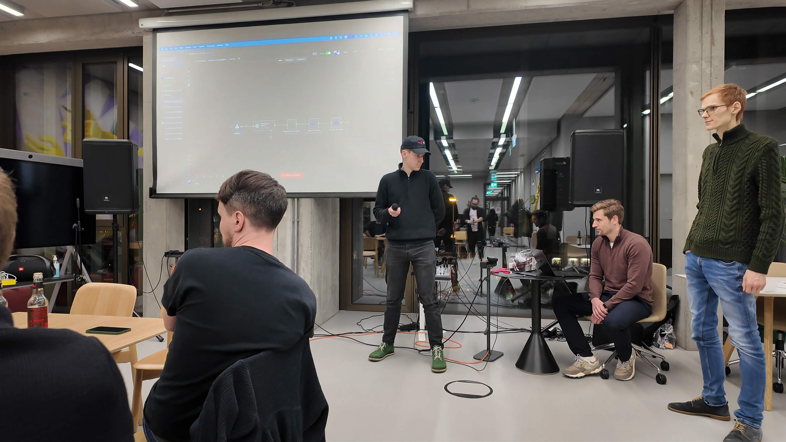

# ElevenLabs Hackathon 2025

[View Project Walkthrough PDF](elevenlabs-agent-walkthrough.pdf)

AI-powered meeting agents that ingest custom knowledge base data and join your online meetings to answer questions in real-time.

This project was built in three hours by a team of three in Berlin as part of the [ElevenLabs Global Hackathon](https://berlin.aitinkerers.org/p/elevenlabs-global-hackathon-berlin).



## Overview

This project enables you to create intelligent agents that can:
- Ingest and learn from your custom knowledge base
- Join online meetings automatically
- Answer questions in real-time using voice

## Tech Stack

- **ElevenLabs** - Voice synthesis and conversational AI
- **n8n** - Workflow automation and agent orchestration
- **AttendeeDev** - Meeting integration and real-time participation

## Getting Started

### Frontend

```bash
cd frontend
pnpm install
pnpm run dev
```

### Backend

```bash
cd backend
pnpm install
pnpm run dev
```

The following environment variables need to be set inside `/backend/.env` and on your server:
```
ATTENDEE_API_TOKEN=<your-token>
N8N_WEBHOOK_URL=<n8n-webhook-url>
ELEVENLABS_API_KEY=<your-token>
```

## Project Structure

```
├── backend/           # express backend
├── frontend/          # react frontend
└── README.md
```